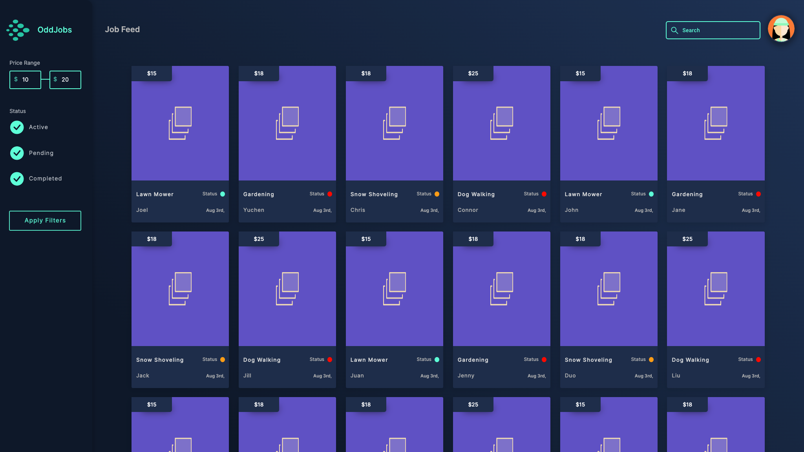
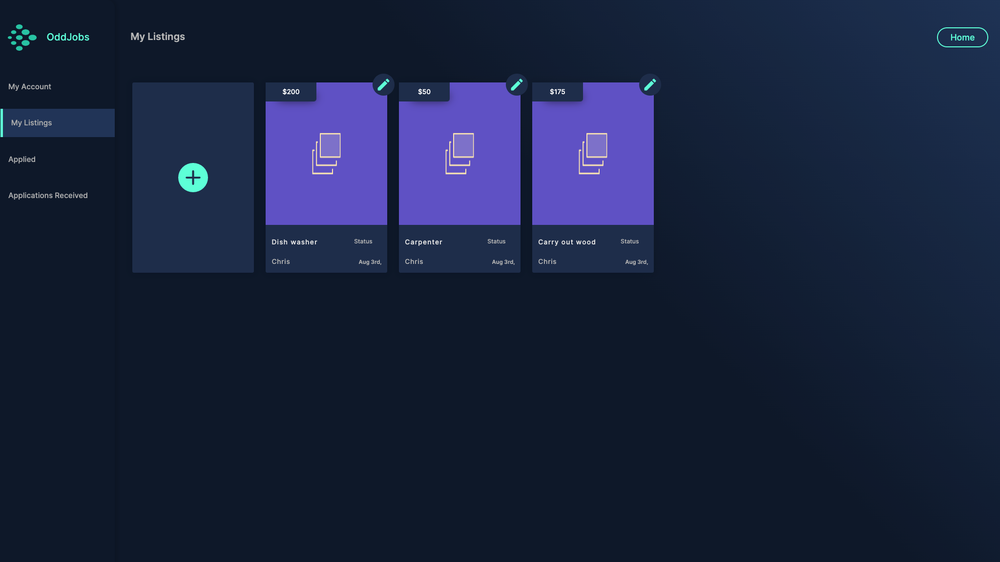
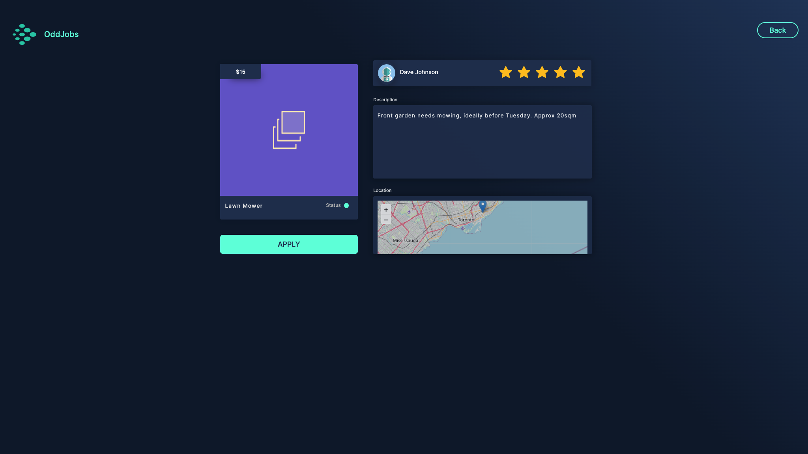

# Odd Jobs: Looking for Work!

## Link to Application

[View Deployed App](https://project3-oddjobs.herokuapp.com/)

## Description
Modern day business' utilize technology to turn simple ideas into profitable outcomes.  The application "Odd Jobs" does this, while also providing users to find workers for their tasks, and provide small job opportunities for those searching.

Odd Jobs acts as a "job" board for small, non-contract based tasks.  Users have the ability to post tasks they want done, for a cost they see fit.  Other users can then apply for these jobs from a home-feed.  Once approved by the job owner, the user will then complete the task and receive payment from the owner.

This application will make finding someone to complete your task easy, and hastle-free!

## User Story
As a user I want to be able to look for, and post tasks I need completed...

* GIVEN the application Odd Jobs
* WHEN I load the application Odd Jobs
* THEN I am prompted to sign-in or sign-up
* WHEN I sign-in or sign-up
* THEN I am taken to the home-page
* WHEN I am on the home page
* THEN a user icon and list of jobs is presented, with a list of the following filter options
    * Min & Max Price
    * Active, Pending, and Completed Status Checks
    * Job Name Search Bar
* WHEN the apply filters button is clicked
* THEN the postings are filtered accordingly
* WHEN I click on a single posting
* THEN the info of that posting is displayed and an apply button
* WHEN I click on the apply button
* THEN I apply to the job, and all appropriate queries are made to update the database
* WHEN I click on the user icon from the homepage
* THEN I am taken to the My Account tab, with three more tabs on the nav for My Listings, Applied, and Applications Received
* WHEN I am on the My Account Tab
* THEN I can see basic information about my profile, and a sign-out button
* When I click on the sign-out button
* THEN my account is signed-out
* WHEN I click on the My Listings tab
* THEN I am presented with the option to add a listing, can view my current listings, and can edit my current listings
* WHEN I click on the button to add a new listing
* THEN I can add the required information and create a new listing
* WHEN I click on the button to edit a current listing
* THEN I can change the required information and create a new listing
* WHEN I click on the Applied tab
* THEN a list of jobs I have applied to is displayed
* WHEN I click on the applications received tab
* THEN I can view the applications I have received for each of my postings

## Technologies Used

### Front-End
* React
    * Toastify
    * Framer Motion
* CSS
* JavaScript
* Bootstrap

### Back-End
* Node.js
* Express
* MongoDb
* Mongoose
* Apollo GraphQL
* JSON Web Tokens
* Bcrypt

## Pictures of Application

